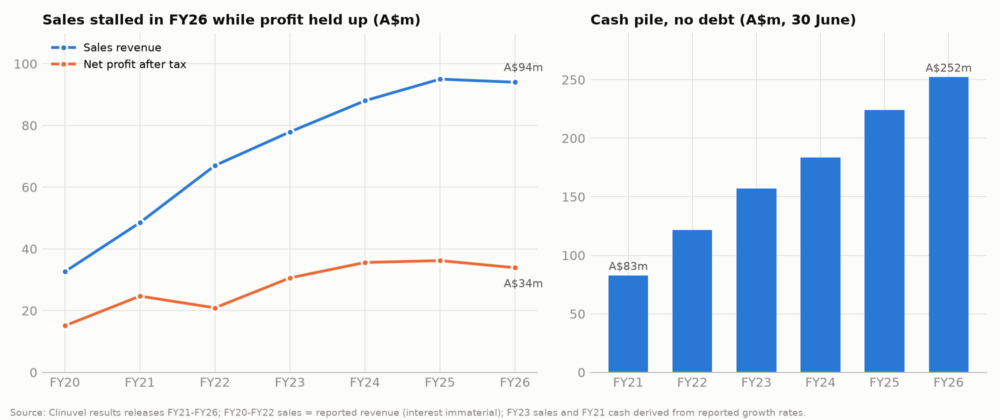
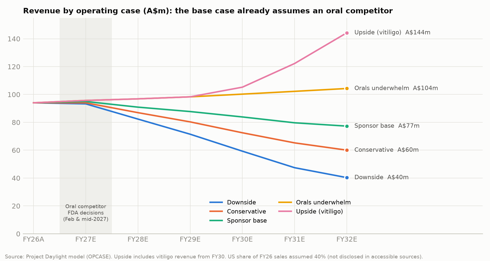
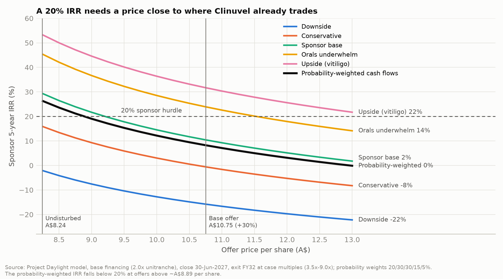

# Clinuvel Pharmaceuticals (ASX: CUV · Nasdaq: CUVL) as a private-equity target

**Deep dive. Information as at 22 September 2026.**
Companion model: [`model/Project_Daylight_LBO_v1.xlsx`](model/Project_Daylight_LBO_v1.xlsx). Codename: "Project Daylight".

> **How to read this.** This is a screening memo written from a buy-side point of view, drawing only on public information.
>
> **Research constraint.** In this session, direct page fetches (SEC EDGAR, clinuvel.com, ASX) were blocked. Facts therefore come from search-engine extracts of the cited pages, not from reading full primary documents such as the 2026 Form 20-F or the FY26 annual report.
>
> **Labels used.** Figures that are estimates or model outputs are labelled as such. Items to verify before any real use are listed in [Appendix B](#appendix-b--data-gaps-and-items-to-verify). Nothing here is investment advice.

---

## 0. Bottom line

**Clinuvel could be a PE target, but it is not an LBO candidate at any price its shareholders would accept today.** It is a cash box sitting on a single product whose monopoly is about to be tested by two oral competitors. A disciplined sponsor can only pay roughly what the market already pays. The more likely paths are the following:

- **Strategic or platform buyer.** A rare-disease strategic, or a PE-backed platform with porphyria or dermatology infrastructure, could pay more by stripping overhead.
- **Activist.** A special-situations or activist investor could force capital return and board change.
- **Opportunistic take-private with CVRs.** This becomes possible only after the Q4-2026 to mid-2027 readouts, and only if the oral competitors disappoint.

**Why it looks like a PE target**
- Ten straight years of profit.
- FY26 revenue of A$94.0m and derived operating EBITDA of about A$42.5m, a 45% margin. That margin is about 70% before about A$23m of discretionary pipeline and marketing spend (analyst estimate).
- A$252m of cash and no debt.
- The share price (about A$8.24) is 1.66x cash per share. The enterprise value (EV) is about A$165m, which is about 3.9x EBITDA and about 2.5x "core" EBITDA.
- A disaffected register: three remuneration-report "strikes" since 2023.
- An obvious cost-out.
- A board already planning to leave the ASX.

**Why it does not work as an LBO**
- **Two oral challengers.** What a buyer would pay for is SCENESSE's monopoly in erythropoietic protoporphyria (EPP). Two oral challengers arrive within about nine months:
  - LEO Pharma's dersimelagon: new drug application (NDA) under priority review, FDA decision expected by end-February 2027.
  - Disc Medicine's bitopertin: Phase 3 APOLLO readout in Q4 2026, FDA decision by mid-2027.
- **Exclusivity is ending.** US orphan exclusivity lapses on 8 October 2026. EU orphan exclusivity lapsed in 2024.
- **The US business is already slipping.** FY26 sales were flat overall and fell about 4% in the second half. Management blames competitors offering free drug and US specialty centres destocking.
- **Little debt capacity.** Lenders will lend perhaps 1.5–2.5x on a shrinking EBITDA base. The "LBO" is really an equity-funded cash harvest: new capital is 75–80% equity, and Clinuvel's own cash funds about 40% of the price.
- **The returns do not clear the hurdle.** Our model makes these assumptions: close on 30 June 2027 after the readouts, sponsor cost-out, a 2.0x private-credit loan, and a five-year hold. On those assumptions:
  - At A$10.75 per share (+30%), the base-case IRR is about 10%.
  - The probability-weighted IRR is about 8%.
  - A 20% probability-weighted IRR needs about **A$8.90 (+8%)**.
  - Without the cost-out, the base case loses money (IRR −7%).
- **Deal-ability is poor today.**
  - The founder-era CEO has 21 years' tenure, a c.6.8% stake and a contract extended to June 2029.
  - The board is committed to a US headquarters move and redomicile, and to a vitiligo Phase 3.
  - About 60% of the register is retail (third-party estimate), anchored to A$30–40 historic highs and to A$18–22 targets from paid and legacy research.

| Screening scorecard (1 = poor, 5 = strong) | Score | One-line rationale |
|---|:-:|---|
| Cash generation and conversion | 5 | FY26 operating cash flow A$36.9m on NPAT A$33.9m; capex-light |
| Balance sheet / cash-funded entry | 5 | A$252m cash, no debt; about 40% of any price can be funded from Clinuvel's own cash |
| Revenue durability / moat | 1–2 | One product, one ultra-rare indication; exclusivities ending; two oral entrants due 2027 |
| Debt capacity | 2 | About 1.5–2.5x EBITDA at best; lenders will size to a downside with US erosion |
| Operational value-creation levers | 4 | About A$20–25m of discretionary spend and listing costs can be cut |
| Growth levers | 2 | EU year-round dosing, Canada and adolescents are real but small; vitiligo is binary and years away |
| Entry valuation | 4 | About 4x EV/EBITDA, but cheap for a reason |
| Management / governance alignment | 1–2 | Founder-style CEO with a standalone US vision; board has backed him through three strikes |
| Deal-ability (register, approvals) | 2 | Retail-heavy, low-turnout register; FIRB plus the new mandatory ACCC regime; redomicile in flight |
| Exit routes | 3 | Credible strategic buyers exist, but a shrinking asset caps the exit multiple |
| **Overall** | **≈2.6 / 5** | **Watch-list, not actionable today; revisit after the Q4-2026 to Q1-2027 readouts** |

**What would make it actionable**
1. **Orals underwhelm.** For example, APOLLO misses and dersimelagon's label or uptake is modest. Our "orals underwhelm" case supports about A$11.50 per share at a 20% IRR.
2. **The share price overshoots on bad news**, taking the market price below the probability-weighted value of the cash plus the European franchise.
3. **The board opens the door.** A second remuneration strike at the upcoming AGM, or a contested redomicile vote, could force it to engage.
4. **The buyer has synergies.** A buyer with an existing porphyria or rare-dermatology footprint can pay above a financial buyer.

---

## 1. Why ask the question now

- **The price has halved from its trading range.**
  - CUV traded around A$11.41 after the H1 FY26 result (February 2026) and closed at **A$9.18 (−12.7%)** on FY26 results day (27 August 2026) ([Business News Australia](https://www.businessnewsaustralia.com/articles/clinuvel-pharmaceuticals-eyes-nasdaq-switch-and-asx-delisting-after-decade-of-unbroken-profit.html)).
  - It was quoted at **A$8.24** on 1 September 2026 ([StockAnalysis](https://stockanalysis.com/quote/asx/CUV/)), down about 31% over twelve months ([Motley Fool](https://www.fool.com.au/2026/08/27/clinuvel-pharmaceuticals-posts-10th-consecutive-profit-and-maintains-dividend/)). The Nasdaq ADS (CUVL, 1:1) traded around US$5.85 on 16 September.
  - Market capitalisation is about A$415m, against A$252m of cash.
- **The CEO has named the risk himself.** In a company-published interview he said a cash-rich balance sheet is "both CLINUVEL's best defence and its biggest takeover risk" ([Clinuvel News](https://news.clinuvel.com/risk-cash-and-a-hostile-takeover-clinuvel-considers-nasdaq-20280901/)).
- **Binary events cluster in the next nine months.**

  | Date | Event | Why it matters |
  |---|---|---|
  | 8 Oct 2026 | US orphan drug exclusivity for SCENESSE expires | Removes the bar on another afamelanotide product for EPP. It never protected against *different* molecules |
  | Oct–Nov 2026 | AGM (date announced 18 Sep 2026) | 2025 remuneration vote was about 63% against (first strike of a new cycle). A second strike triggers a board-spill resolution |
  | Nov 2026 | CUV107 (EU pivotal vitiligo, 300 patients) starts | Commits a large multi-year spend before CUV105 reads out |
  | Q4 2026 | Disc Medicine APOLLO Phase 3 topline (bitopertin) | Positive data leads to a US decision around mid-2027 |
  | Dec 2026 | CUV105 Phase 3 vitiligo topline | The only pipeline value driver of size |
  | 1 Jan 2027 | HQ moves to the US; reorganisation (up to about 20% of staff) | Execution risk; one-off costs |
  | ~end-Feb 2027 | FDA decision on LEO's dersimelagon (priority review) | First oral EPP therapy; same receptor class as SCENESSE |
  | H1 2027 (tbc) | Possible scheme to insert a foreign "New HoldCo", list ordinary shares on Nasdaq and delist from the ASX | 75% shareholder vote; changes takeover law and defences |
  | Mid-2027 | FDA decision on bitopertin (if APOLLO is positive) | Second oral competitor |

- **The company is changing its legal and market home.**
  - Its ADSs began trading on Nasdaq Global Select on 20 July 2026 after the 20-F registration went effective on 17 July ([GlobeNewswire](https://www.globenewswire.com/news-release/2026/07/20/3329427/0/en/clinuvel-s-ads-to-commence-trading-on-nasdaq.html)).
  - On 27 August the board said it is considering listing the ordinary shares on Nasdaq and delisting from the ASX and Frankfurt. This would be done via a scheme of arrangement that puts a new foreign holding company on top ([Clinuvel](https://www.clinuvel.com/2026/08/clinuvel-considers-nasdaq-listing-asx-delisting-2026-08-27/)).
  - For a bidder, the window before redomicile is different in kind from the one after it (section 11).

---

## 2. The business in one page

**Product**
- SCENESSE (afamelanotide 16 mg) is a biodegradable implant the size of a rice grain. It is inserted under the skin by a trained professional, about every two months.
- It is an α-MSH analogue, a melanocortin-1 receptor (MC1R) agonist. It raises skin melanin and gives photoprotection to adults with **EPP**.
- EPP is an ultra-rare inherited disorder. Protoporphyrin IX accumulates, causing severe phototoxic pain within minutes of light exposure.
- SCENESSE is marketed as "the world's first, and currently only, systemic photoprotective drug".

**Approvals**

| Jurisdiction | Status |
|---|---|
| EU | December 2014, under "exceptional circumstances" with annual review; year-round dosing (no 4-implant cap) from September 2025 ([EMA](https://www.ema.europa.eu/en/medicines/human/EPAR/scenesse); [Clinuvel](https://www.clinuvel.com/wp-content/uploads/2025/09/20250923-ema-approves-year-round-scenesse-treatment.pdf)) |
| US | 8 October 2019 (NDA 210797) |
| Australia | 2020 |
| Israel | 2021 |
| Canada | 13 July 2026 ([GlobeNewswire](https://www.globenewswire.com/news-release/2026/07/13/3325896/0/en/SCENESSE-approved-for-EPP-in-Canada.html)) |
| Adolescents | Adults only everywhere. The EU adolescent extension was withdrawn in April 2024 pending more data ([Clinuvel](https://www.clinuvel.com/2024/06/clinuvel-withdraws-scenesse-label-expansion-for-adolescent-erythropoietic-protoporphyria-20240603/)) |

**Commercial model**
- Accredited treatment centres: more than 120 in North America, backed by more than 100 insurers (FY26 release). Clinuvel sells direct in the EU and US.
- More than 18,500 implants have been administered to date.

**Price**

| Market | Price | Source |
|---|---|---|
| US | About US$44–49k per implant (Medicare J7352 rates imply an average sales price of about US$44k; GoodRx cash price about US$49k), or about US$265–295k per patient-year at 6 implants | [GoodRx](https://www.goodrx.com/scenesse), [J7352](https://www.datalilyai.com/cpt/j7352) |
| Germany | €28.2k per implant set by the 2017 AMNOG arbitration | [GlobeNewswire](https://www.globenewswire.com/news-release/2017/04/12/959306/0/en/CLINUVEL-reaches-agreement-on-German-SCENESSE-pricing-through-AMNOG-Arbitration-Board.html) |

**Scale (analyst estimate)**
- At a blended A$40–60k per implant, A$94m of sales is about 1,600–2,400 implants a year.
- That implies only a few hundred patients worldwide on therapy.
- Against prevalence of roughly 1:75,000–1:140,000 in the US and EU, penetration is probably below 15%.

**Concentration**
- Effectively 100% of revenue comes from one product in one indication.
- All revenue is earned in Europe and North America. The geographic split is not visible in accessible disclosure; the model assumes 40% US (tested at 30–50%).

**Portfolio beyond SCENESSE** (section 5)
- Vitiligo (afamelanotide plus narrowband UVB light therapy, NB-UVB) is the only program with meaningful spend.
- PRÉNUMBRA (stroke), NEURACTHEL (ACTH), DNA-repair/XP, variegate porphyria, CYACÊLLE/PhotoCosmetics and a Singapore R&D centre are small or early.

---

## 3. Financial profile

**A$m, year to 30 June**

| | FY20 | FY21 | FY22 | FY23 | FY24 | FY25 | FY26 |
|---|--:|--:|--:|--:|--:|--:|--:|
| Product revenue (SCENESSE) | 32.6* | 48.5* | 67.0* | ~77.9† | 88.0 | 95.0 | **94.0** |
| Total revenues incl. interest and other | 32.6 | 48.5 | 67.0 | 83.0 | 95.3 | 105.3 | 101.2 |
| Total expenses | | | | | ~44.8† | 53.7 | 53.5 |
| Profit before tax | | | 34.3 | | ~50.6† | 51.6 | ~47.7† |
| NPAT | ~15.1† | 24.7 | 20.9 | 30.6 | 35.6 | 36.2 | **33.9** |
| Cash at 30 June (no debt) | | ~82.7† | 121.5 | 157.0 | ~183.7† | 224.1 | **252.1** |
| Dividend per share (A$, fully franked) | | | 0.04 | | | 0.05 | 0.05 |

\* As-reported revenue; interest was immaterial then. † Derived from reported growth rates or differences.
Sources: company results releases FY21–FY26 ([FY26](https://www.globenewswire.com/news-release/2026/08/27/3351774/0/en/a-decade-of-profitability-provides-foundation-for-clinuvel-s-u-s-expansion.html), [FY25](https://www.clinuvel.com/wp-content/uploads/2025/08/20250828-clinuvel-delivers-ninth-consecutive-revenues-growth-profit.pdf), [FY24](https://www.marketscreener.com/quote/stock/CLINUVEL-PHARMACEUTICALS--6492603/news/Clinuvel-Pharmaceuticals-Limited-Reports-Earnings-Results-for-the-Full-Year-Ended-June-30-2024-47754296/), [FY23](https://annualreport.clinuvel.com/wp-content/uploads/2023/08/app4e2023-financials.pdf), [FY22](https://www.clinuvel.com/2022/08/revenue-growth-drives-clinuvels-sixth-consecutive-annual-profit-20220830/), [FY21](https://www.clinuvel.com/2021/08/clinuvel-delivers-record-revenues-and-profit/)).

**What the numbers say**

1. **Growth has stopped.**
   - Sales compounded about 28% a year FY20–FY24 on the US launch. Growth then slowed to about 8% in FY25 and −1% in FY26.
   - H1 FY26 sales were A$36.9m (+4%), so **H2 FY26 fell about 4%**.
   - The FY26 release says growth in Europe (helped by the September 2025 year-round dosing label) offset "marginal declines in U.S. sales as some competitors offered free drug treatment to EPP patients", plus US specialty centres moving to just-in-time ordering.
   - **The first competitive leakage is already visible, before any competitor is approved.** Trial and expanded-access programmes are pulling US patients.
2. **Margins are high but diluted by discretionary spend.**
   - FY26 product revenue less total expenses was about A$40.5m. That is roughly 43% before interest income, and about A$42.5m EBITDA if D&A is about A$2m (estimate).
   - Expenses rose 20% in FY25: personnel +31%, clinical +215%, communications and branding +100%.
   - The company's FY26–FY28 budget averages **A$55–58m a year excluding communications, branding and marketing** (per a March 2026 Parmantier & Cie note). That implies FY27 costs rising again.
3. **Interest income flatters profit.** About A$7.1m of FY26 "total revenues" is interest and other income, about 15% of pre-tax profit. A buyer that uses the cash loses it.
4. **Cash conversion is excellent.** Operating cash flow was A$36.9m against NPAT of A$33.9m. Capex and working capital are minor, and cash grew A$28m after dividends.
5. **Capital allocation is the controversy.**
   - Dividends are token: A$0.05 a share, about A$2.5m, about 7% of profit.
   - Buybacks have been small. A renewed programme covered up to 1.5m shares ([Stockhead](https://stockhead.com.au/health/biocurious-while-other-biotechs-scratch-around-for-cash-clinuvel-is-accused-of-having-too-much/)).
   - Management's stated use of the cash is to "self-finance its diversification plans with key emphasis on expansion in North America".

**Estimated FY26 cost base by function**

These are analyst estimates, calibrated to the reported A$53.5m total and to external research ranges. Clinuvel does not disclose costs this way in accessible sources.

| Bucket | FY26 est. (A$m) | Keep, cut or manage under PE |
|---|--:|---|
| Cost of goods, supply and distribution | 7.0 | Keep; gross margin above 90% |
| Core SCENESSE commercial, medical, pharmacovigilance and regulatory | 11.0 | Keep; add competitive-defence spend |
| Corporate, listing and G&A (ASX + SEC/Nasdaq) | 10.5 | Cut about 35–45%: delisting, board, HQ duplication |
| Communications, branding, marketing and consumer (CBM, CYACÊLLE) | 5.0 | Cut to about 1.0 |
| Vitiligo clinical (CUV105, then CUV107) | 12.0 | Stop CUV107, or partner it / fund via CVR |
| Other R&D (Singapore, PRÉNUMBRA, NEURACTHEL, XP/VP) | 6.0 | Cut to about 1.5 (lifecycle only) |
| D&A | 2.0 | — |
| **Total** | **53.5** | |

**"Core" earning power:** about A$42.5m reported EBITDA plus about A$23m of discretionary spend gives about **A$65m (≈70% margin)**, before any corporate savings. That gap is the sponsor thesis. The question is how fast the revenue under it shrinks.

---

## 4. The crux: how long SCENESSE's cash flows last

### 4.1 Exclusivity and IP

| Protection | Status | Comment |
|---|---|---|
| US new chemical entity exclusivity | Expired Oct 2024 | Generic patent challenges possible since Oct 2023 |
| **US orphan drug exclusivity** | **Expires 8 Oct 2026** ([DrugPatentWatch](https://www.drugpatentwatch.com/p/tradename/SCENESSE)) | Only ever blocked the *same* drug for EPP; irrelevant to bitopertin or dersimelagon |
| EU orphan market exclusivity | Lapsed Dec 2024 (EMA; Clinuvel's filing says Oct 2024) | No generic or hybrid entrant has appeared in about 21 months, per the company |
| US patent 8,334,265 (method of treating photodermatoses) | Listed expiry **20 Jan 2033** after patent-term extension ([PharmaCompass](https://www.pharmacompass.com/patent-expiry-expiration/afamelanotide); [Federal Register](https://www.federalregister.gov/documents/2021/11/04/2021-24074/determination-of-regulatory-review-period-for-purposes-of-patent-extension-scenesse)) | A method-of-use claim on a 1980s peptide; validity needs an opinion. Clinuvel says its patents run "2026 to 2033" |
| EU supplementary protection certificate | Possibly to about Dec 2029 (Dutch SPC NL300926 seen) | Unverified |
| Practical barriers | Complex controlled-release implant; accredited-centre model; tiny market | Deters generics, **but does nothing against a different molecule** |

**Conclusion:** generic risk is a tail risk before about 2030–2033. **New-mechanism oral competition is the real risk, and it is imminent.**

### 4.2 The two oral challengers

**1. Dersimelagon (LEO Pharma).** Oral MC1R agonist, the same receptor class as SCENESSE.
- On 18 August 2026, Bain-owned Tanabe Pharma agreed to sell worldwide rights to LEO Pharma for up to US$435m upfront and near-term milestones, plus royalties.
- LEO announced FDA acceptance of the NDA with **priority review**, and closed the purchase on 18 September 2026. A decision is expected **by end-February 2027** ([LEO](https://leo-pharma.com/media-center/news/leo-pharma-further-strengthens-late-stage-pipeline-with-the-acquisition-of-dersimelagon/); [LEO NDA](https://leo-pharma.com/media-center/news/leo-pharma-announces-fda-acceptance-of-dersimelagon-nda-with-priority-review-and-closes-acquisition-from-tanabe-pharma/); [Fierce Biotech](https://www.fiercebiotech.com/biotech/leo-bets-435m-tanabes-regulatory-approval-ready-rare-dermatology-drug)).
- LEO is a global dermatology specialist with European reach. An EU filing is likely to follow (timing unknown).

**2. Bitopertin (Disc Medicine).** Oral GlyT1 inhibitor that lowers protoporphyrin IX (PPIX) production.
- The FDA issued a Complete Response Letter on **13 February 2026**. It accepted that bitopertin lowers PPIX but found no evidence that this translated into better sunlight tolerance.
- The Phase 3 **APOLLO** trial, fully enrolled early in March 2026, reads out in **Q4 2026**. If positive, an FDA decision would come **by mid-2027** ([Disc](https://ir.discmedicine.com/news-releases/news-release-details/disc-medicine-receives-complete-response-letter-fda-bitopertin); [PharmExec](https://www.pharmexec.com/view/fda-crl-disc-medicine-eythropoietic-protoporphyria-treatment-bitopertin)).
- The FDA's objection is the same weakness that has dogged EPP trials: modest, hard-to-measure effects on sunlight tolerance. **APOLLO is a genuine coin-flip.**

**Why this matters more than the exclusivity dates**
- A once-daily pill versus a clinic visit every two months will win many *new* US patients by default.
- The US book is small (probably a few hundred patients), concentrated and demonstrably mobile. Clinuvel has already lost some to "free drug" programmes.
- Payers may impose step or dual-therapy restrictions once an oral option exists.
- **Europe is stickier.** LEO has not announced EU timing. National reimbursement takes years, and year-round EU dosing is a fresh tailwind. But EU regulatory exclusivity is gone.
- **Where SCENESSE holds up:**
  - long-term safety data (about 10+ years commercial);
  - adherence (no daily pill);
  - severe patients, where combination therapy (SCENESSE plus a PPIX-lowering drug) is mechanistically plausible;
  - any modest efficacy or tolerability profile for the orals.

### 4.3 Scenario framework used in the model

| Operating case | Story | US SCENESSE, FY27→FY32 | EU & RoW, FY27→FY32 | FY32 revenue | Weight (illustrative) |
|---|---|---|---|--:|--:|
| 1. Downside | Both orals approved and adopted fast; EU oral from FY29; price pressure | −8%, −35%, −35%, −25%, −20%, −15% | +4%, +2%, −5%, −15%, −20%, −15% | A$40m | 20% |
| 2. Conservative | Dersimelagon approved Feb-27 with solid uptake; bitopertin also approved; EU competition from FY30 | −6%, −25%, −25%, −15%, −10%, −8% | +4%, +3%, 0%, −8%, −10%, −8% | A$60m | 30% |
| **3. Sponsor base** | Dersimelagon approved; APOLLO misses or is delayed; SCENESSE keeps implant-preferring and severe patients | −5%, −18%, −15%, −8%, −5%, −3% | +5%, +4%, +2%, −3%, −5%, −3% | **A$77m** | 30% |
| 4. Orals underwhelm | Orals approved but modest; combination use; Canada, adolescents and year-round dosing drive growth | −3%, −5%, −3%, 0%, +2%, +2% | +5%, +5%, +4%, +3%, +2%, +2% | A$104m | 15% |
| 5. Upside (vitiligo) | Case 4 plus CUV105 positive; sponsor funds CUV107; vitiligo launch from FY30 | as case 4 | as case 4 | A$144m | 5% |

**The base case already assumes an oral competitor.** It is the right underwriting case for a leveraged buyer. The probability weights are our judgement, not data: roughly 80% that at least one oral is approved and takes meaningful US share (cases 1–3). Section 8.6 shows the answer is robust to the US/EU split.

---

## 5. Pipeline and diversification: what a PE owner would keep

| Program | Status (Sept 2026) | Est. annual cost | PE view |
|---|---|---|---|
| **Vitiligo: CUV105** (SCENESSE + NB-UVB vs NB-UVB, 210 patients, 37 sites, 57% US; primary endpoint T-VASI50) | Topline **December 2026** ([Clinuvel](https://www.clinuvel.com/2026/07/update-scenesse-in-vitiligo-20260728/)); open-label; case reports only so far | A$10–15m (with CUV107) | **CVR candidate.** Plausible niche (darker skin types IV–VI, extensive disease, patients who won't take JAKs). But the drug alone failed (CUV104), the regimen needs twice-weekly phototherapy plus implants about every 3 weeks, and oral JAKs (upadacitinib etc.) are arriving first. Estimated 40–60% chance CUV105 hits its endpoint; about 30% chance of approval by about 2030 |
| **Vitiligo: CUV107** (EU pivotal, 300 patients) | Starts November 2026 on EMA scientific advice ([GlobeNewswire](https://www.globenewswire.com/news-release/2026/04/24/3280522/0/en/clinuvel-receives-final-ema-scientific-advice-for-pivotal-phase-iii-vitiligo-study.html)) | A$25–45m over FY27–30 (est.) | Committed *before* CUV105 reads out. A sponsor would stop it, or partner it, unless CUV105 is strongly positive. **Check CRO cancellation terms** |
| Adolescent EPP / SCENESSE lifecycle | EU refiling pending; no US paediatric filing found | <A$2m | **Keep.** Protects the core |
| PRÉNUMBRA (liquid afamelanotide; stroke) | Early; "advanced" per FY26 webinar | Small now; US$50–150m+ if taken to late stage | **Cut or license out.** Stroke neuroprotection has a very poor success rate |
| NEURACTHEL (ACTH) | Named "second revenue source" by a paid broker; no filing verified | A$2–6m | Fund only to milestones, or sell. US ACTH market is about US$0.8–0.9bn (Acthar, Cortrophin) |
| DNA repair / XP; variegate porphyria | Small studies; winding down per FY26 commentary | <A$1–2m each | **Park** |
| CYACÊLLE / PhotoCosmetics; communications and branding | M-lines pre-launch pushed to 2027 | A$4–7m (with communications) | **Cut** |
| Singapore R&D and innovation centre (EDB-supported five-year expansion, Dec 2025) | Expanding | A$3–6m | **Scale back** to formulation work; check grant clawbacks |
| US HQ relocation, Nasdaq/SEC, New HoldCo | From 1 Jan 2027 | A$2–4m recurring plus one-offs | Pause; a take-private removes listing costs |

Sources: [CUV105 recruitment](https://www.globenewswire.com/news-release/2025/05/07/3075714/0/en/CLINUVEL-recruits-200-patients-in-Phase-III-vitiligo-trial-CUV105.html), [vitiligo commercial update](https://www.clinuvel.com/2026/07/commercial-update-on-vitiligo-20260730/), [CUV102 JAMA Dermatology](https://pubmed.ncbi.nlm.nih.gov/25230094/), [Singapore expansion](https://finance.yahoo.com/news/clinuvel-expands-singapore-rd-centre-023700781.html).

**Takeaway**
- About A$20–25m a year of spend is discretionary.
- Cutting it roughly **doubles the proportion of revenue that becomes cash** in the base case (see the model: FY28E Adj. EBITDA A$57.5m versus A$30.1m on management's plan).
- The vitiligo option can be handed back to selling shareholders through a CVR rather than funded on spec.

---

## 6. Ownership, governance and who has to say yes

### Register

| Item | Detail |
|---|---|
| Shares | About **50.4m** ordinary shares (derived from Vanguard's 5.003% = 2,523,018 shares, Form 603, 14 Aug 2026). Dilution is small: the CEO holds no LTI and the share count rose only about 0.8% in two years |
| Foreign holders | **Over 66%** (company, 23 Jul 2026), mostly North America and Europe |
| Retail vs institutions | Individuals about 59–60%, institutions about 20–23% (Simply Wall St estimates) |
| German retail | Large, via the Frankfurt listing |
| **CEO Dr Philippe Wolgen** | About **3.43m shares (≈6.8%)**; largest individual holder |
| BNY Mellon (about 8.7–9.7% on screens) | Most likely the ADS depositary pool, not a single investor |
| Vanguard | Crossed 5% on 10 Aug 2026 and fell back below it (4.97%) on 27 Aug |
| Other large holders | At least one unnamed ≥5% holder filed change notices between September 2025 and April 2026; **identify before any approach** |
| AGM turnout | Low: about 25–40% of capital |

**Voting arithmetic**
- In a scheme, about 10–15% of issued capital voting against can block the 75% test at typical turnout.
- In a takeover bid, more than 10% blocks compulsory acquisition.
- The CEO plus about 3% of like-minded holders is enough either way.
- Sobi (2021) is the cautionary precedent: Advent and GIC stalled at about 87% against a 90% condition.

### Board and management

- **Chair:** Prof. Jeffrey Rosenfeld, neurosurgeon, Chair since 1 January 2024 ([Clinuvel](https://www.clinuvel.com/wp-content/uploads/2023/12/20231031-cuv-appoints-new-chair-1.pdf)).
- **Non-executive directors:** Karen Agersborg, Matthew Pringle, Dr Pearl Grimes (a prominent US pigmentation dermatologist; check independence relative to the vitiligo program) and Susan Smith.
- **CEO/MD Dr Philippe Wolgen:** in the role for about 21 years.
  - Contract extended in July 2026 to **30 June 2029**. Retention payments and LTIs were removed, and the STI is up to 100% of base ([Clinuvel](https://www.clinuvel.com/2026/07/clinuvel-confirms-terms-of-ceos-employment-agreement-20260702/)).
  - The board called his continuation "a strategic imperative" for a 24–36 month execution phase ([TipRanks summary](https://www.tipranks.com/news/company-announcements/clinuvel-backs-ceo-wolgen-as-cash-rich-biotech-prioritises-vitiligo-push)).
  - COO Lachlan Hay is the other visible executive.
  - Key-person risk is very high, and no succession plan is visible.
- **Remuneration.** CEO total pay was about A$7.1m in FY22 and A$5.24m in FY25 (+40%) ([Stockhead](https://stockhead.com.au/health/health-check-at-risk-of-a-third-strike-clinuvel-argues-its-executive-pay-is-appropriate/)).

**Remuneration-report votes**

| AGM | Vote against | Outcome |
|---|---|---|
| 2023 | 39.7% | First strike |
| 2024 | About 52% | Second strike; the spill resolution won only about 10% support |
| 2025 | About 63% | First strike of a new cycle |

Sources: [ASX 2024](https://announcements.asx.com.au/asxpdf/20241016/pdf/0695wmk0wy92by.pdf), [ASX 2025](https://announcements.asx.com.au/asxpdf/20251017/pdf/06qpb53gztyvtg.pdf).

The pattern is clear: holders dislike the pay and the strategy but will not remove the board. **The 2026 AGM can deliver another spill vote.**

- **Style.** The disclosure is idiosyncratic: "Authentically authored, Non-AI" shareholder letters, and takeover risk discussed on the company's own media site. The March 2026 Chair's letter re-committed to vitiligo and the CEO.
- **Coverage is thinning.** Morningstar signalled it will cease coverage (earlier fair value A$18). Morgans cut to Hold. Paid German research (Parmantier) has a Buy with an A$22 target.

### Likely board response to a PE approach

- **At a 25–35% premium (A$10–11), expect hostility.** The board would argue that its plan, the vitiligo readout and the Nasdaq re-rating are worth more, and it has publicly positioned the cash as a defence.
- **The counter-pressure is real.** It comes from directors' duties when an offer is well above an A$8 share price that is 1.66x cash, from proxy advisers who have sided against management three times, and from a potential second strike.
- **A pragmatic path is a management-inclusive proposal.** The CEO rolls equity and keeps a role in a vitiligo "SpinCo" or CVR, so the founder is not asked to sell his life's work at a trough. This triggers Takeovers Panel Guidance Note 19 protocols and, in the US, Rule 13e-3 considerations.

---

## 7. Valuation: what is Clinuvel worth, and to whom?

### 7.1 What the market is pricing

| At A$8.24 | Value |
|---|--:|
| Market cap (about 50.7m fully diluted shares) | about A$418m |
| Cash (30 Jun 2026) | A$252m (A$4.97/share) |
| **Enterprise value** | **about A$165m** |
| EV / FY26 revenue | 1.8x |
| EV / FY26 operating EBITDA (about A$42.5m) | 3.9x |
| EV / "core" EBITDA before discretionary spend (about A$65m) | 2.5x |
| P/E (FY26 EPS A$0.68) | 12.1x; about 5.7x excluding cash and interest income |
| Implied perpetual decline in status-quo unlevered FCF (about A$28m) | **−4% to −6% a year** at a 10–12% WACC |

The market is pricing SCENESSE as a melting ice cube run under management's spending plan. It also puts no value on vitiligo and applies a governance discount to the cash.

### 7.2 Intrinsic value by scenario (DCF, control basis)

Method: unlevered FCF FY28–FY32 from the model, with sponsor cost-out included, plus a terminal value (growth: −15% / −8% / −3% / +1% / +3%) plus cash at close, per fully diluted share, valued at 30 June 2027.

| Case | EV (A$m, 10% WACC) | A$/share @10% | A$/share @12% |
|---|--:|--:|--:|
| 1. Downside | 109 | 7.57 | 7.46 |
| 2. Conservative | 192 | 9.22 | 8.90 |
| 3. Sponsor base | 308 | 11.52 | 10.77 |
| 4. Orals underwhelm | 548 | 16.26 | 14.35 |
| 5. Upside (vitiligo) | 733 | 19.90 | 16.57 |
| **Probability-weighted** | **291** | **11.17** | **10.37** |
| *Management plan, base revenue, no cost-out* | *147* | *8.34* | *7.99* |

**How to read this**
- The public market (A$8.24) is roughly valuing Clinuvel at its **status-quo** intrinsic value, meaning management's plan plus a competitive base case.
- The **control value**, meaning cost-out plus returning cash, is about **A$10.4–11.2**.
- That uplift of about A$2–3 per share (+25–35%) is about the size of a normal ASX takeover premium.
- **A financial buyer would therefore hand most of its value creation to sellers**, and would underwrite a coin-flip on the orals without a margin of safety. That is the core reason the LBO does not clear the hurdle.

### 7.3 Multiples cross-check

**Sponsor buyouts of scaled specialty pharma: about 10–14x EBITDA.** Premiums were only 13–46%, often because the sponsor already had control.

| Deal | Year | Multiple / premium | Source |
|---|---|---|---|
| CVC → Recordati | 2018 | 12.9x EBITDA | [CVC](https://www.cvc.com/media/news/2018/2018-06-29-cvc-fund-vii-acquires-controlling-stake-in-recordati-spa/) |
| CVC + GBL → Recordati take-private | 2026 | About 12x; offer €51.29, acceptances close 15 Oct 2026 | [Recordati](https://recordati.com/investors-public-tender-offers/) |
| Bain & Cinven → Stada | 2017 | 13.4x | [BSIC](https://bsic.it/going-one-going-twice-sold-cinven-bain-capital-acquire-stada-e5-3bn-intense-bidding-war/) |
| CapVest → Stada | 2025 | About 10x | [Stada](https://www.stada.com/blog/posts/2025/september/capvest-to-acquire-majority-stake-in-stada-from-bain-capital-and-cinven) |
| Triton → Clinigen | 2022 | 14x | [S&P](https://www.spglobal.com/marketintelligence/en/news-insights/latest-news-headlines/clinigen-recommends-sweetened-163-1-3b-triton-offer-68447375) |
| DBAY → Alliance Pharma | 2025 | About 46% premium | [Pharm. Tech.](https://www.pharmaceutical-technology.com/news/alliance-pharma-agrees-to-362m-acquisition-by-dbay/) |
| Advent/GIC → Sobi (failed) | 2021 | 34.5% premium | [BioPharma Dive](https://www.biopharmadive.com/news/sobi-acquisition-withdrawn-advent-gic/610945/) |

**Strategic rare-disease acquisitions: about 5–6x sales for portfolios.** Premiums were about 90–110%, often with CVRs.

| Deal | Terms | Source |
|---|---|---|
| Chiesi → Amryt | 2023; about 4.7x upfront, 107% premium plus a CVR | [Chiesi](https://www.chiesi.com/en/chiesi-farmaceutici-s.p.a.-to-acquire-amryt-pharma-plc/) |
| Recordati → EUSA | 2022; about 5.8x sales | [Fierce Pharma](https://www.fiercepharma.com/pharma/recordati-to-acquire-eusa-pharma-for-eu750m-gaining-4-rare-cancer-drugs) |
| Sobi → CTI | 2023; 89% premium | [Sobi](https://www.sobi.com/en/press-releases/sobi-acquire-cti-biopharma-corp-enhancing-sobis-position-rare-haematology-2124874) |

- **These multiples do not transfer.** They are for diversified or growing franchises. A single product facing two new entrants is valued on remaining-life cash flows.
- At our base offer of A$10.75, the implied TEV is A$269m:
  - 7.4x FY27E status-quo EBITDA;
  - **4.7x FY28E post-cost-out EBITDA**;
  - 2.8x revenue.
- That is already full for a financial buyer. A strategic with synergies (sales infrastructure, porphyria centres, overhead) could justify 4–5x sales in the benign cases.

---

## 8. LBO feasibility: model results

The model is a single-tab vertical LBO with case architecture: MCASE (24 cases), OPCASE (6), FINCASE (4), ATP, Contrib, Sensitivity and CVR. It has 2,965 live formulas and zero errors. The balance sheet balances every year, and the ATP circularity check passes. See [Appendix A](#appendix-a--model-architecture-and-how-to-use-it).

### 8.1 Key assumptions (base case: MCASE 3)

- **Timing:** signed after the readouts; closes **30 June 2027** (end FY27E). FY27E runs on management's plan and budget, which gives FY27E Adj. EBITDA of A$36.5m (down from about A$42.5m).
- **Offer:** **A$10.75 per share** (+30% to A$8.24) × 50.68m fully diluted shares = **A$544.8m** equity purchase price.
- **Cash:** Clinuvel's pre-deal cash at close is A$275.5m (FY26 cash plus FY27 free cash flow less dividend). A$40m of minimum cash is retained, so **A$235.5m of target cash is applied**.
- **Debt:** unitranche from a specialist healthcare private-credit lender:
  - **2.0x** FY27E EBITDA = A$75m;
  - base rate plus 6.00% (about 9.6% all-in);
  - 2.5% OID; 5% annual amortisation plus a 100% cash sweep;
  - A$20m revolving credit facility, undrawn.
- **Fees:** transaction expenses of 2.75% of equity value (A$15.0m); financing fees of A$2.1m.
- **Sponsor plan:**
  - cut corporate costs 35%, rising to 45% (delisting, board, HQ);
  - cut communications, branding and marketing to A$1.0m and other R&D to A$1.5m;
  - wind down vitiligo (CUV107 not funded);
  - add A$1.0–1.5m a year of competitive-defence spend;
  - A$4m one-off restructuring.
- **Other:** 28% tax. Excess cash is distributed once the debt is repaid.
- **Exit:** at FY32E (year 5) on LTM Adj. EBITDA. Exit multiples: 3.5x downside, 4.5x conservative, 5.5x base, 7.0x orals-underwhelm, 9.0x upside.

**Sources & uses (base case, A$m)**

| Uses | A$m | | Sources | A$m | % |
|---|--:|---|---|--:|--:|
| Purchase of equity (fully diluted) | 544.8 | | Clinuvel cash applied | 235.5 | 42% |
| Transaction expenses | 15.0 | | Unitranche term loan (2.0x) | 75.0 | 13% |
| Financing fees | 2.1 | | Sponsor equity | 251.4 | 45% |
| **Total** | **561.9** | | **Total** | **561.9** | 100% |

- Equity is **77% of new capital** (equity plus new debt).
- Pro forma net debt / EBITDA is 0.96x; gross leverage is 2.05x.
- Minimum EBITDA / cash interest over the hold is 9.9x.
- Debt is repaid by FY29.

### 8.2 Base-case operating profile (A$m)

| | FY26A | FY27E (status quo) | FY28E | FY29E | FY30E | FY31E | FY32E |
|---|--:|--:|--:|--:|--:|--:|--:|
| Revenue | 94.0 | 95.0 | 90.9 | 87.7 | 83.9 | 79.7 | 77.3 |
| Adj. EBITDA | 42.5 | 36.5 | 57.5 | 57.4 | 53.7 | 49.2 | 46.4 |
| Adj. EBITDA margin | 45% | 38% | 63% | 65% | 64% | 62% | 60% |
| Discretionary pipeline and communications spend | (23.0) | (26.7) | (4.5) | (2.5) | (2.5) | (2.5) | (2.5) |
| Free cash flow after interest and tax | | 25.9 | 35.1 | 40.3 | 39.2 | 36.0 | 33.7 |
| Distributions to equity | | | – | 0.5 | 39.2 | 36.0 | 33.7 |

### 8.3 Returns by operating and financing case (offer A$10.75, 5-year hold)

| IRR (MoIC) | Base 2.0x | High 3.0x + 0.75x PIK | Low 1.0x | No debt |
|---|:-:|:-:|:-:|:-:|
| 1. Downside | −15.8% (0.45x) | −31.5% (0.15x) | −14.2% (0.53x) | −13.6% (0.59x) |
| 2. Conservative | −0.6% (0.97x) | −2.9% (0.86x) | −0.2% (0.99x) | 0.0% (1.00x) |
| **3. Sponsor base** | **10.4% (1.59x)** | 10.9% (1.68x) | 10.2% (1.53x) | 10.1% (1.48x) |
| 4. Orals underwhelm | 23.9% (2.74x) | 26.7% (3.23x) | 23.0% (2.52x) | 22.5% (2.37x) |
| 5. Upside (vitiligo) | 31.7% (3.83x) | 36.0% (4.66x) | 30.2% (3.47x) | 29.6% (3.22x) |
| **Probability-weighted cash flows** | **8.3% (1.45x)** | | | |
| *Management plan, no cost-out (MCASE 24)* | *−6.6% (0.71x)* | | | |

**What the grid says**
1. **Leverage barely matters in the base case:** +/− 0.5 points of IRR. Debt capacity is small relative to a price funded mostly by Clinuvel's own cash and sponsor equity. Leverage **destroys** the downside: the high-leverage downside case loses about 85% of equity.
2. **The operating case dominates everything.** The spread from downside to orals-underwhelm is about 40 IRR points.
3. **Cost-out is necessary but not sufficient.** Without it, the base case loses money (−6.6%). With it, the base case still only earns about 10%.
4. **Returns decay with hold length** as the base-case EBITDA erodes. IRR by exit year: Y1 24%, Y2 18%, Y3 14%, Y4 11%, Y5 10%. **A "cut and sell within two years" plan to a strategic beats a five-year harvest**, if a buyer will pay 5.5x peak cost-out EBITDA.

### 8.4 What a sponsor can pay (ability to pay)

| Max offer per share for a 20% IRR (base financing, case exit multiple) | A$/share | Premium to A$8.24 |
|---|--:|--:|
| 1. Downside | 6.76 | −18% |
| 2. Conservative | 7.89 | −4% |
| **3. Sponsor base** | **9.20** | **+12%** |
| 4. Orals underwhelm | 11.53 | +40% |
| 5. Upside (vitiligo) | 13.51 | +64% |
| **Probability-weighted cash flows** | **≈8.90** | **≈+8%** |

**Base case, IRR by offer price and exit multiple**

| Offer (A$) | 4.0x | 5.0x | 6.0x | 7.0x | 8.0x |
|---|:-:|:-:|:-:|:-:|:-:|
| 9.00 (+9%) | 17.1% | 20.2% | 23.1% | 25.6% | 28.0% |
| 10.00 (+21%) | 10.1% | 13.1% | 15.8% | 18.3% | 20.5% |
| 11.00 (+33%) | 5.0% | 7.9% | 10.5% | 12.9% | 15.0% |
| 12.00 (+46%) | 1.0% | 3.8% | 6.4% | 8.7% | 10.8% |
| 13.00 (+58%) | −2.2% | 0.5% | 3.0% | 5.2% | 7.3% |

**Robustness to the US/EU revenue split** (not disclosed; the model assumes 40% US):

| US share of FY26 sales | Probability-weighted IRR at A$10.75 | Average max price for a 20% IRR |
|---|--:|--:|
| 30% | 10.2% | A$9.17 |
| 40% (model) | 8.3% | A$8.88 |
| 50% | 6.2% | A$8.60 |

### 8.5 Value creation bridge (base case, A$m)

| Driver | A$m | Share |
|---|--:|--:|
| EBITDA growth from revenue (declining sales) | −50.2 | −34% |
| EBITDA growth from margin (sponsor cost-out) | +122.9 | +82% |
| Multiple contraction (7.4x entry on status-quo EBITDA → 5.5x exit) | −87.1 | −58% |
| Deleveraging and cash generation (including A$109m distributions) | +184.3 | +124% |
| Entry fees | −17.1 | −11% |
| Exit costs | −3.8 | −3% |
| **Total value created** | **+149.1** | 100% |

This is a **cash-harvest thesis wrapped around a cost-out**, not a growth or re-rating story. For the IC, the fragility is that the only positive operational driver is cost-out, which any strategic buyer could also capture. The cash generation is only as durable as SCENESSE.

### 8.6 Sanity checks and limitations

- The ATP reverse-LBO check reproduces the running offer to four decimal places.
- The value bridge reconciles to the returns.
- The downside case "breaks" the deal, as it should.
- **Limitations:**
  - The cost split, the US/EU split, working capital, financing terms and all forward scenarios are analyst assumptions.
  - Tax is modelled as a flat 28%, with no cash-location or withholding-tax effects. The group has Swiss, Irish, UK and US subsidiaries, and trapped-cash costs could matter (section 12).

---

## 9. How a sponsor could make it work: structuring toolkit

1. **Wait for the readouts.** Sign after APOLLO topline (Q4 2026), CUV105 topline (December 2026) and ideally the dersimelagon FDA decision (about February 2027).
   - Price certainty is worth more than the risk of paying a higher post-readout price. The grid above shows the price *range* is about A$6.8–13.5 depending on the outcome.
   - Aim to be in front of the board before the New HoldCo scheme meeting (section 11).
2. **Bridge the bid–ask with CVRs.** Make them non-transferable and have the independent expert value them. CVRs are uncommon in ASX schemes (they need disclosure and expert valuation) but standard in US biotech M&A.
   - **CVR 1 (competition):** A$1.00 per share if FY29 SCENESSE revenue is at least A$90m. It pays only in the "orals underwhelm" world, when the sponsor can afford it. Probability about 20%; expected PV about A$0.16 per share.
   - **CVR 2 (vitiligo):** A$1.00 per share on FDA or EC approval in vitiligo by 30 June 2030. Probability about 30%; expected PV about A$0.21 per share. It lets holders (and the founder) keep the vitiligo dream without the sponsor funding CUV107 on spec.
   - **Result:** A$10.75 cash plus two A$1 CVRs is a **headline A$12.75** (+55%) for an expected PV cost of about A$19m (model CVR tab).
3. **Use Clinuvel's cash, carefully.** Fund the purchase with certain-funds equity plus a bank bridge, then repay the bridge from target cash after completion.
   - Repaying from target cash needs a whitewash under Corporations Act s260A/s260B.
   - **First, diligence where the A$252m sits.** Upstreaming from Clinuvel AG (Switzerland), Ireland or the UK could attract withholding tax.
   - A pre-implementation **fully franked special dividend** helps only Australian residents (under 34% of the register). It is capped by the franking account balance, which is not disclosed in accessible sources. It cannot be funded by new equity (s207-159 ITAA 1997). Unfranked dividends to foreign holders attract withholding unless paid out of conduit foreign income.
4. **Keep debt modest.** Use 1.5–2.0x specialist private credit (lenders such as Pharmakon, Oaktree, Blackstone Life Sciences, HPS or Sixth Street) with amortisation, a sweep, and product-specific default triggers. **No holding-company PIK notes**: the downside wipes out equity.
   - Synthetic-royalty financing is feasible but small. An 8–10% royalty on SCENESSE raises only about A$35–50m at a 12–15% implied cost.
5. **Founder alignment.** Offer a rollover or reinvestment at the same price, a board seat or a role in a vitiligo vehicle.
   - This requires a separate scheme class or tagged votes under a Guidance Note 19 protocol.
   - Under US rules it may trigger Rule 13e-3 affiliate status if Clinuvel is still an SEC registrant (Tier I exemption if US holders are 10% or less).
   - **Alternatively, underwrite a CEO transition.** Diligence must test whether the commercial franchise is institutional or personal.
6. **Draft the MAC clause around the competitor calendar.** Define explicitly whether a dersimelagon or bitopertin approval is excluded or is a condition. The Mayne Pharma–Cosette dispute (2025) is the cautionary Australian precedent for litigated MAC clauses.
7. **Alternative PE-style routes that may fit better than a buyout**
   - **Activist or value stake** (5–10%) to push a capital return (the cash is about A$5 per share) and board renewal around the second-strike and redomicile votes.
   - **"Split" proposal:** return most of the cash (A$3–4 per share), cut costs, and spin vitiligo into an unlisted vehicle with the founder, leaving a lean cash-generative SCENESSE company.
   - **Structured minority** (convertible preferred) to fund a US commercial push. This is unlikely to appeal; the company does not need cash.

---

## 10. Buyer universe (ranked by plausibility)

| Rank | Buyer | Why | Obstacles |
|:-:|---|---|---|
| 1 | **Recordati (CVC/GBL, private from about Q4 2026)** | Rare-disease consolidator; porphyria footprint (Panhematin in the US, Normosang in the EU; background knowledge); CVC knows the playbook; buys commercial products (EUSA, Enjaymo) | Its own take-private is absorbing capacity; it would price on remaining-life cash flows |
| 2 | **Chiesi** (family-owned) | Rare dermatology via Amryt (with a CVR); patient-centric rare-disease model | No stated interest |
| 3 | **PE-backed brand acquirers:** Advanz (Nordic Capital), SERB, Clinigen (Triton), Alliance (DBAY), Pharmanovia, Cheplapharm (family) | Pay for cash flows; strip overhead into an existing platform | Size and complexity (US and EU direct model, implant supply) |
| 4 | **Generalist sponsors:** Bain (now unconflicted after selling dersimelagon), EQT (Galderma heritage), Advent (Sobi attempt), KKR, TPG, Carlyle | Capacity; healthcare teams; Bain and TPG have ASX healthcare experience | A single-product binary asset is small for flagship funds; better as structured or royalty capital |
| 5 | **LEO Pharma** | Would own both MC1R agonists in EPP; defensive logic | Serious antitrust risk; it just paid for the competitor |
| 6 | Sobi, Ipsen, Pharming, Esteve, Kyowa Kirin, Jazz | Active rare-disease buyers | Fit is medium |
| 7 | Australian PE: BGH, PEP, Crescent, Adamantem | Local presence | Global pharma risk profile; co-investor at most |

No public statement links any of these parties to Clinuvel. Market commentary on Clinuvel as a target could not be searched within this session's limits.

---

## 11. Deal mechanics and the redomicile window

| | **Today (Australian company, ASX + Nasdaq ADS)** | **After a New HoldCo redomicile (jurisdiction undisclosed; possibly US)** |
|---|---|---|
| Friendly route | Scheme of arrangement: 75% of votes cast **and** a majority by number (the court may disregard the headcount test); two court hearings; independent expert ("best interests"); 1% break fee guideline; no-shop/no-talk with a fiduciary out; matching rights | Merger under the local statute (e.g. Delaware: board approval plus a majority of outstanding shares; appraisal rights) |
| Hostile route | Off-market bid: bidder picks the minimum acceptance (control at 50.1%; **90%** for compulsory acquisition); no defensive "frustrating action" permitted | Board may be able to adopt a rights plan or other defences (if Delaware) |
| US securities overlay | A scheme is not a tender offer; §3(a)(10) exemption for scrip; Tier I/II cross-border relief depends on the US holder share (rising after the Nasdaq listing) | Full US tender-offer and proxy regime; Rule 13e-3 if affiliates roll |
| Approvals | **FIRB** (many global PE funds are treated as "foreign government investors" because of sovereign LPs, which means an A$0 threshold; assume FIRB is a condition; 30 days plus extensions); **ACCC** mandatory, suspensory regime since 1 Jan 2026 (check thresholds); possible EU/UK foreign-investment screens | Local merger control; FIRB as long as Australian assets or entities remain |
| Leverage point | The redomicile scheme itself needs **75% approval**; dissatisfied holders or a bidder can use that vote | — |

**Implication:** a sponsor that wants Australian-law protections (no defences, scheme certainty, §3(a)(10)) and a register that is still partly Australian should move before the New HoldCo scheme meeting.

---

## 12. If a sponsor did buy it: the 100-day plan

1. **Vitiligo decision in week one**, on the CUV105 data: stop or pause CUV107, partner it, or ring-fence it in a CVR vehicle. Renegotiate CRO commitments.
2. **Cost-out:**
   - delist (ASX, Nasdaq, Frankfurt);
   - resize the board;
   - collapse the Melbourne/US HQ duplication;
   - close or sublet the Singapore expansion (check EDB clawbacks);
   - cut the communications, branding and consumer lines.
   - Target: **A$20–25m run-rate**.
3. **Defend the franchise:**
   - a patient-services and hub programme in the US;
   - payer contracting ahead of the orals;
   - real-world evidence on durability and combination use;
   - EU adolescent refiling and a US paediatric plan;
   - Canada launch;
   - maximise EU year-round dosing uptake;
   - disciplined pricing (Germany AMNOG renegotiation risk).
4. **Supply security:** dual-source the implant and API; review CMO change-of-control clauses.
5. **Cash and tax:** map cash by entity; plan repatriation; set a distribution policy; a small unitranche.
6. **Exit preparation:** package a cash-generative rare-dermatology asset for Recordati, Chiesi or LEO, or run a distribution-harvest strategy if no buyer appears at 5x+ EBITDA.

---

## 13. Key risks, red flags and diligence questions

**Risks, highest first**
1. Speed of oral competitor uptake (US, then EU).
2. Pricing pressure and payer step-edits.
3. Single-source implant supply.
4. EU "exceptional circumstances" status and annual review.
5. Validity of the '265 method-of-use patent.
6. Key-person and founder-transition risk.
7. Trapped cash and withholding tax.
8. FX (EUR/USD revenue against AUD reporting).
9. Execution of the US relocation and a 20% workforce cut in the middle of a competitive launch.
10. Committed vitiligo costs.
11. Register blocking stakes and headcount-test risk.
12. The redomicile changes the rules mid-process.

**Top diligence questions**
1. Revenue, implants and patients by country FY20–FY26, including US new starts and discontinuations, and gross-to-net.
2. How much of the FY26 US decline came from trial "free drug" leakage versus destocking? What was the H2 FY26 monthly run-rate?
3. Dersimelagon and bitopertin: labels, pricing, payer strategy, EU plans. Do physicians plan to combine, switch or add?
4. APOLLO design and power; CUV105 statistical analysis plan (randomisation, blinded photo review, why results arrive in December).
5. Is the '265 patent term extension final? Any Paragraph IV notices? EU SPC coverage?
6. API and implant manufacturers, contracts, inventory, change-of-control clauses.
7. Cash by entity and repatriation costs; the franking account balance.
8. CEO contract terms (notice, termination, change-of-control), and any s200B approvals.
9. CUV107 and CRO commitments and cancellation costs; Singapore EDB grant terms.
10. Identity of the unnamed ≥5% holder; top-20 register; the US holder percentage (Tier I/II status).
11. New HoldCo jurisdiction and timetable.
12. Any regulatory commitments attached to EU exceptional circumstances or the US post-marketing programme.

---

## 14. Conclusion and what to watch

- **Clinuvel is a textbook "cheap for a reason" cash box.** The cash and cost-out make it look like a PE target. The imminent arrival of oral competitors, a founder-led board with a standalone plan, and a retail register anchored far above today's price make it a poor candidate for a conventional LBO in 2026.
- **The market is roughly right.** At A$8.24, it values Clinuvel close to what a disciplined sponsor could pay for a 20% IRR (about A$8.90). A sponsor would have to pay a 30–50% premium to win.
- **A sponsor should put Clinuvel on a watch list with a pre-built model** (this one) and act only on one of the triggers below.
  - **Most likely buyers:** a rare-disease strategic or PE-owned platform (Recordati/CVC first), which can absorb the overhead and pay above a pure financial buyer.
  - **Most likely near-term "PE-style" event:** activism around capital return and board renewal, not a buyout.

**Triggers to revisit**

| Trigger | What it would change |
|---|---|
| APOLLO misses (Q4 2026) and/or dersimelagon gets a narrow label or is delayed (about Feb 2027) | Base case shifts toward "orals underwhelm"; affordable price about A$11.50 |
| CUV105 positive (Dec 2026) | A vitiligo CVR becomes valuable to sellers; bridges the founder's price expectations |
| Second remuneration strike or spill vote at the 2026 AGM | Board more open to engage |
| New HoldCo scheme booklet published | Last window under Australian takeover law |
| Share price below about A$7 (about 1.4x cash) on bad news | Downside protection improves; even conservative cases clear about 15% |
| Recordati take-private completes (acceptances close 15 Oct 2026) | Most logical strategic buyer regains capacity |

---

## Appendix A — Model architecture and how to use it

**Files**
- [`model/Project_Daylight_LBO_v1.xlsx`](model/Project_Daylight_LBO_v1.xlsx) — the workbook. Built by [`model/build_model.py`](model/build_model.py); cases run by [`model/run_cases.py`](model/run_cases.py); charts from [`model/make_charts.py`](model/make_charts.py).

**Tabs**

| Tab | Content |
|---|---|
| Cover | Key outputs of the running case and model checks |
| Hist | FY20–FY26 history plus FY26A base-year inputs, with sources; estimates flagged |
| MCASE | Master case driver. 24 cases: 5 operating × 4 financing at A$10.75, plus CEO-rollover, A$9.50, A$12.50 and no-cost-out variants |
| OPCASE | 6 operating cases: revenue by region, cost lines, sponsor cost-out, capex, working capital |
| FINCASE | 4 financing cases: 2.0x, 3.0x + 0.75x PIK, 1.0x, no debt |
| LBO | Single-tab vertical model: transaction assumptions, S&U, purchase accounting, PF balance sheet, IS, BS, CF, debt schedule (revolver → term loan → PIK cascade), interest (CIRC switch), credit metrics, returns (IRR with interim distributions), exit-multiple and exit-year grids |
| ATP | Maximum offer per share by exit multiple × hurdle IRR, with a circularity check |
| Contrib | Value creation bridge |
| Sensitivity | Live price × multiple grids; self-referencing case-capture table; operating × financing matrices; probability-weighted view; price × operating case |
| CVR | Design and valuation of the two CVRs |

**Conventions**
- Blue = input, black = formula, green = cross-tab link.
- Named controls: `MCASE`, `OPCASE`, `FINCASE`, `CIRC`, `MIN_CASH`, `PROJECT`, `OUT_IRR`, `OUT_MOIC`, `CHECKS`.
- **Iterative calculation must be on** (the file stores this setting). Average-balance interest and the capture cells are circular by design.

**Refreshing the case tables**
- **In Excel:** set MCASE to 1…24 in turn, then back to 3.
- **Headless:** `python3 model/build_model.py && python3 model/run_cases.py model/Project_Daylight_LBO_v1.xlsx` runs every case in LibreOffice to convergence and saves the cached values.

## Appendix B — Data gaps and items to verify

Items the model or memo relies on that could not be verified against primary documents in this session:

- **US / Europe revenue split** (assumed 40% US), and patient and implant counts by region.
- **FY26 expense split by function** (estimated to sum to the reported A$53.5m), D&A, working capital and PP&E.
- **Dilutive securities.** Performance rights are assumed at 0.25m.
- **Current share price** (22 Sep 2026) and the 52-week range. We use the A$8.24 close of 1 Sep 2026.
- **Franking account balance**, cash by legal entity, and the CEO's change-of-control terms.
- **Company-plan FY27 figures.** FY27E costs follow the reported budget range (A$55–58m a year ex-communications) from third-party research.
- **Dersimelagon's Phase 3 data and exact PDUFA date**; APOLLO design; whether LEO has filed in the EU.
- **Final '265 patent-term-extension certificate**; EU SPC status.
- **Identity of the unnamed ≥5% holder**; top-20 holders; 2025 AGM director votes.
- **Mayne–Cosette outcome**; the 2026 FIRB and ACCC thresholds.

## Appendix C — Principal sources

**Company**
- [FY26 results release (27 Aug 2026)](https://www.globenewswire.com/news-release/2026/08/27/3351774/0/en/a-decade-of-profitability-provides-foundation-for-clinuvel-s-u-s-expansion.html)
- [FY25 release](https://www.clinuvel.com/wp-content/uploads/2025/08/20250828-clinuvel-delivers-ninth-consecutive-revenues-growth-profit.pdf)
- [H1 FY26 Appendix 4D](https://www.clinuvel.com/wp-content/uploads/2026/02/20260226-appendix-4d-half-year-report.pdf)
- [Strategic reorganisation (23 Jul 2026)](https://www.globenewswire.com/news-release/2026/07/23/3331849/0/en/clinuvel-implements-strategic-reorganisation-to-refocus-on-u-s-markets.html)
- [Nasdaq listing / ASX delisting consideration (27 Aug 2026)](https://www.clinuvel.com/2026/08/clinuvel-considers-nasdaq-listing-asx-delisting-2026-08-27/)
- [ADS on Nasdaq (20 Jul 2026)](https://www.globenewswire.com/news-release/2026/07/20/3329427/0/en/clinuvel-s-ads-to-commence-trading-on-nasdaq.html)
- [20-F public filing](https://www.clinuvel.com/2026/06/clinuvel-publicly-files-20-f-registration-statement-to-u-s-sec-20260616/)
- [CEO agreement (Jul 2026)](https://www.clinuvel.com/2026/07/clinuvel-confirms-terms-of-ceos-employment-agreement-20260702/)
- [Chair's letter (20 Mar 2026)](https://www.clinuvel.com/wp-content/uploads/2026/03/20260320-chairs-letter-to-shareholders.pdf)
- ["Risk, Cash and a Hostile Takeover"](https://news.clinuvel.com/risk-cash-and-a-hostile-takeover-clinuvel-considers-nasdaq-20280901/)
- [Vitiligo update (Jul 2026)](https://www.clinuvel.com/2026/07/update-scenesse-in-vitiligo-20260728/)
- [AGM date (18 Sep 2026)](https://www.clinuvel.com/2026/09/clinuvel-date-of-annual-general-meeting-20260918/)

**Market and governance**
- [Motley Fool AU FY26](https://www.fool.com.au/2026/08/27/clinuvel-pharmaceuticals-posts-10th-consecutive-profit-and-maintains-dividend/)
- [Business News Australia](https://www.businessnewsaustralia.com/articles/clinuvel-pharmaceuticals-eyes-nasdaq-switch-and-asx-delisting-after-decade-of-unbroken-profit.html)
- [Kalkine: Vanguard substantial holding](https://kalkine.com.au/news/announcements/vanguard-group-becomes-substantial-holder-in-clinuvel-pharmaceuticals-with-5003-voting-power)
- [Stockhead: executive pay](https://stockhead.com.au/health/health-check-at-risk-of-a-third-strike-clinuvel-argues-its-executive-pay-is-appropriate/)
- [Stockhead: cash criticism](https://stockhead.com.au/health/biocurious-while-other-biotechs-scratch-around-for-cash-clinuvel-is-accused-of-having-too-much/)
- [Fierce Biotech: workforce reduction](https://www.fiercebiotech.com/biotech/australian-biopharma-clinuvel-shed-20-workforce-move-us)
- [Morningstar: cease coverage](https://www.morningstar.com/company-reports/1483804-intention-to-cease-coverage-of-clinuvel)
- [Parmantier & Cie update (Mar 2026)](https://cdn.prod.website-files.com/66d025412a2cb352455e5880/69c42d99e382ffc41a7d7475_26_03_25_CUV_PCR_Update_H1_FY%2026-Report_english.pdf)

**Competition and IP**
- [LEO: dersimelagon acquisition](https://leo-pharma.com/media-center/news/leo-pharma-further-strengthens-late-stage-pipeline-with-the-acquisition-of-dersimelagon/)
- [LEO: NDA priority review](https://leo-pharma.com/media-center/news/leo-pharma-announces-fda-acceptance-of-dersimelagon-nda-with-priority-review-and-closes-acquisition-from-tanabe-pharma/)
- [Disc Medicine CRL](https://ir.discmedicine.com/news-releases/news-release-details/disc-medicine-receives-complete-response-letter-fda-bitopertin)
- [EMA EPAR](https://www.ema.europa.eu/en/medicines/human/EPAR/scenesse)
- [DrugPatentWatch](https://www.drugpatentwatch.com/p/tradename/SCENESSE)
- [PharmaCompass](https://www.pharmacompass.com/patent-expiry-expiration/afamelanotide)

**Precedents**
- [CVC–Recordati](https://www.cvc.com/media/news/2018/2018-06-29-cvc-fund-vii-acquires-controlling-stake-in-recordati-spa/)
- [Recordati tender offer](https://recordati.com/investors-public-tender-offers/)
- [Advent/GIC–Sobi](https://www.biopharmadive.com/news/sobi-acquisition-withdrawn-advent-gic/610945/)
- [Bain & Cinven–Stada](https://bsic.it/going-one-going-twice-sold-cinven-bain-capital-acquire-stada-e5-3bn-intense-bidding-war/)
- [CapVest–Stada](https://www.stada.com/blog/posts/2025/september/capvest-to-acquire-majority-stake-in-stada-from-bain-capital-and-cinven)
- [Triton–Clinigen](https://www.spglobal.com/marketintelligence/en/news-insights/latest-news-headlines/clinigen-recommends-sweetened-163-1-3b-triton-offer-68447375)
- [DBAY–Alliance](https://www.pharmaceutical-technology.com/news/alliance-pharma-agrees-to-362m-acquisition-by-dbay/)
- [Nordic Capital–Advanz](https://www.nordiccapital.com/news-views/press-releases/nordic-capital-launches-recommended-cash-offer-for-advanz-pharma/)
- [Chiesi–Amryt](https://www.chiesi.com/en/chiesi-farmaceutici-s.p.a.-to-acquire-amryt-pharma-plc/)
- [Recordati–EUSA](https://www.fiercepharma.com/pharma/recordati-to-acquire-eusa-pharma-for-eu750m-gaining-4-rare-cancer-drugs)
- [Sobi–CTI](https://www.sobi.com/en/press-releases/sobi-acquire-cti-biopharma-corp-enhancing-sobis-position-rare-haematology-2124874)
- [Bain–Tanabe](https://www.baincapital.com/news/bain-capital-acquire-mitsubishi-tanabe-pharma-corporation)
